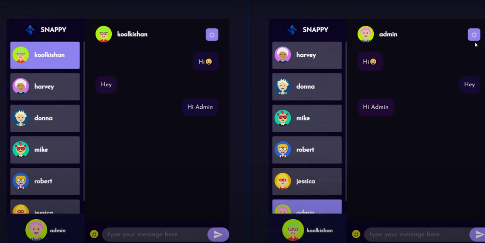

# Chat-Application




### Primary Requirements
- [Nodejs](https://nodejs.org/en/download)
- [Mongodb](https://www.mongodb.com/docs/manual/administration/install-community/)

Both should be installed and make sure mongodb is running

```shell
git clone https://github.com/Arjun-Raghav/Chat-Application.git
cd Chat-Application
```

Rename env files from .env.example to .env
```shell
cd public
mv .env.example .env
cd ..
cd server
mv .env.example .env
cd ..
```

Install the dependencies
```shell
cd server
yarn
cd ..
cd public
yarn
```

To run the Frontend:
```shell
cd public
yarn start
```

To run the Backend:
Open another terminal in folder, Also make sure mongodb is running in background.
```shell
cd server
yarn start
```

Now it will open localhost:3000 in your browser.

